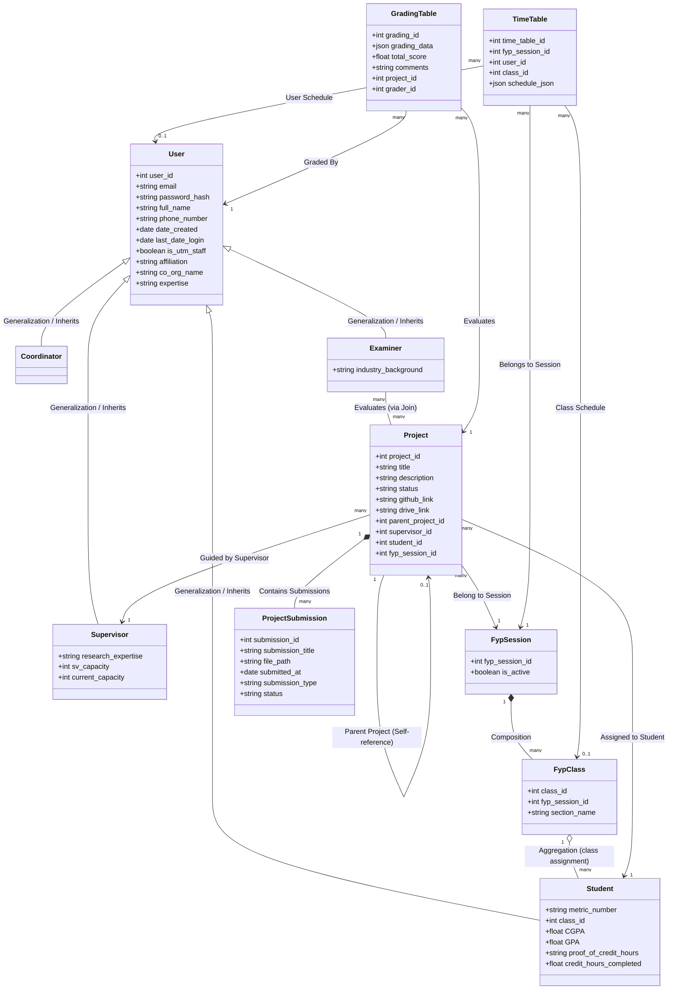

# Software Design Document (SDD)
## I-FAMOUS System - Coordinator Module

This document outlines the technical specification and interface design for the **Coordinator Module** of the **I-FAMOUS Web System**. It documents the front-end layout system, design tokens, core component interactions, route mapping, and back-end API endpoints.

---

## 1. System Layout & Design System

To present a premium, unified experience throughout the system, the coordinator module enforces a consistent layout structure across all its pages. 

### A. Layout Architecture
Every view in the coordinator module wraps itself in a flex column container (`flex flex-col min-h-screen`) using:
- **Global Background**: `#e7ded3` (represented by the Tailwind variable `bg-[#e7ded3]`), providing a warm, high-contrast, paper-like background.
- **Typography**: The primary typeface is **Inter** (`font-['Inter']`), designed for interface legibility.
- **Top Bar**: [AppHeader.vue](file:///d:/Github/application-development-project/src/components/common_components/AppHeader.vue) remains fixed or sticky, providing quick notifications, current role status, and user account toggles.
- **Split Content Wrapper**: Beneath the header, a flex row layout splits into:
  - [AppSidebar.vue](file:///d:/Github/application-development-project/src/components/common_components/AppSidebar.vue) on the left (visible on large screen sizes `hidden lg:flex` with a width of `280px`).
  - A `<main>` section on the right, configured to grow (`flex-1`) with custom scrolling (`overflow-y-auto`) and standardized padding (usually `px-10 py-8` or `px-[50px] py-[30px]`).
- **Footer**: [AppFooter.vue](file:///d:/Github/application-development-project/src/components/common_components/AppFooter.vue) is pinned to the bottom of the column wrapper (`mt-auto`).

```mermaid
graph TD
    A[Global Flex Layout: min-h-screen flex flex-col bg-[#e7ded3]] --> B[AppHeader Component]
    A --> C[Split Body Wrapper: flex flex-1]
    C --> D[AppSidebar: 280px left navigation]
    C --> E[Main Content Container: flex-1 px-10 py-8]
    A --> F[AppFooter Component: mt-auto]
```

### B. Core Branding & Colors
The visual style is aligned with Universiti Teknologi Malaysia (UTM) guidelines, defined as custom tailwind properties inside [main.css](file:///d:/Github/application-development-project/src/assets/main.css):

| Token Name | Hex Value | Application |
| --- | --- | --- |
| **UTM Maroon** | `#5c001f` | Primary buttons, headers, active sidebar links, primary texts |
| **UTM Dark Maroon** | `#2d000f` | Header backgrounds, footer backgrounds |
| **UTM Gold** | `#f8be17` | Accent labels, page hero decorations, borders, badges |
| **Neutral Canvas** | `#e7ded3` | Main workspace background (light theme) |
| **Surface Off-white** | `#ffffff` | Panel cards, user tables, modal dialog surfaces |

---

## 2. Reusable Layout & Common Components

The coordinator module leverages modular, reusable Vue components to build dynamic pages:

### 1. Header component: [AppHeader.vue](file:///d:/Github/application-development-project/src/components/common_components/AppHeader.vue)
- Displays the official white UTM Ascend logo alongside the brand name "I-FAMOUS".
- Integrates the [NotificationCenter.vue](file:///d:/Github/application-development-project/src/components/common_components/NotificationCenter.vue) drawer component.
- Dynamically detects the logged-in user's role and retrieves its navigation configuration from [navigation.js](file:///d:/Github/application-development-project/src/config/navigation.js).
- Handles responsive layouts by exposing a collapsible sliding menu overlay on mobile viewports.

### 2. Sidebar component: [AppSidebar.vue](file:///d:/Github/application-development-project/src/components/common_components/AppSidebar.vue)
- Enforces list items that change design based on route match (`isActive` helper checks route matching prefixes).
- Highlighted active tabs utilize the Maroon color (`bg-[#5c001f] text-white shadow`) while inactive links hover cleanly (`text-gray-600 hover:bg-gray-100`).
- The navigation configuration maps the coordinator role to the following links:
  - **Dashboard**: `/dashboard` (icon: `dashboard`)
  - **Manage Sessions**: `/manage-session` (icon: `sessions`)
  - **View Calendar**: `/calendar` (icon: `calendar`)
  - **Add Timetable**: `/add-time-table` (icon: `timetable`)
  - **Manage Users**: `/manage-user` (icon: `users`)
  - **Manage FYP**: `/manage-fyp` (icon: `document`)
  - **Bulk Import**: `/import-users` (icon: `import`)

### 3. Footer component: [AppFooter.vue](file:///d:/Github/application-development-project/src/components/common_components/AppFooter.vue)
- Implements a solid footer using `bg-utm-dark-maroon` with a solid UTM Gold top-border.
- Contains left-aligned branding for UTM and the Malaysia-Japan International Institute of Technology (MJIIT).
- Displays developer team attribution ("Made by the team: Fukushima, Japan") and dynamic copyright year.

### 4. Step Tracker component: [WorkflowSteps.vue](file:///d:/Github/application-development-project/src/components/common_components/WorkflowSteps.vue)
- A horizontal card layout rendering step milestones. Used inside the FYP proposal pipeline to showcase progress status.

### 5. Utility Indicators: [StatsCard.vue](file:///d:/Github/application-development-project/src/components/StatsCard.vue) and [StatusBadge.vue](file:///d:/Github/application-development-project/src/components/StatusBadge.vue)
- **StatsCard**: Standard card highlighting numerical metrics (e.g., student counts, lecturer totals).
- **StatusBadge**: Displays color-coded badges matching proposal or timeline states:
  - *Approved*: Emerald badge
  - *Pending*: Amber badge
  - *Rejected*: Rose/Red badge

---

## 3. Coordinator Views & Pages Reference

Below is the software specification for each view accessible to system coordinators.

### A. Dashboard View
- **Route**: `/dashboard`
- **File**: [DashboardView.vue](file:///d:/Github/application-development-project/src/views/coordinator/DashboardView.vue)
- **Features**:
  - Displays the active Academic Session (fetched from Pinia state via `useCalendarStore`).
  - "Create New Session" action button that spawns [CreateSessionModal.vue](file:///d:/Github/application-development-project/src/components/CreateSessionModal.vue).
  - Quick indicators grid mapping: Total Projects, Projects Needing Supervisor, and Missed Deadlines.
  - Quick totals displaying user counts per category (Students, Staff, Examiners).
  - System Activity Log displaying recent student events (e.g., "Proposal Submitted").

### B. Session Management View
- **Route**: `/manage-session`
- **File**: [ManageSessionView.vue](file:///d:/Github/application-development-project/src/views/coordinator/ManageSessionView.vue)
- **Features**:
  - Retrieves lists of past and current academic session definitions.
  - Implements inline CRUD operations, allowing coordinators to edit session numeric IDs or delete unused sessions.
  - Connects to the database/JSON backend via Express middleware to guarantee integrity.

### C. User Administration View
- **Route**: `/manage-user` (list view), `/manage-user/:id` (detail profile view)
- **Files**: [ManageUserView.vue](file:///d:/Github/application-development-project/src/views/coordinator/ManageUserView.vue), [ViewUserView.vue](file:///d:/Github/application-development-project/src/views/coordinator/ViewUserView.vue)
- **Features**:
  - Renders a multi-category user list (Students, Lecturers, Outsiders).
  - Implements category-specific pagination logic to minimize payload size.
  - Integrates user-creation ([CreateUserForm.vue](file:///d:/Github/application-development-project/src/components/CreateUserForm.vue)) and edit modal overlays ([EditUserModal.vue](file:///d:/Github/application-development-project/src/components/EditUserModal.vue)).
  - ViewUserView shows granular profiles, including affiliation logs and project status.

### D. Bulk Data Ingestion Hub
- **Route**: `/import-users`
- **File**: [UserBulkDataImportView.vue](file:///d:/Github/application-development-project/src/views/coordinator/UserBulkDataImportView.vue)
- **Features**:
  - Implements drag-and-drop or click-to-upload area for bulk user provisioning files (CSV, Excel).
  - Validates formatting parameters before routing payloads to backend database creation scripts.

### E. FYP Module proposals Pipeline
- **Route**: `/manage-fyp`
- **File**: [ManageFYPProposalsView.vue](file:///d:/Github/application-development-project/src/views/coordinator/fyp_module/ManageFYPProposalsView.vue)
- **Features**:
  - Houses the core approval and allocation pipelines via a two-tab interface:
    - **Submitted Proposal Queue**: Renders `SubmittedProposalQueue.vue` containing list items of submitted ideas. It provides inline actions to Approve or Reject. When rejecting, it pops up a prompt demanding justification feedback.
    - **Assign Supervisor**: Renders `FYPAssignSupervisor.vue` which allows coordinators to analyze matches and open the `AssignSupervisorDrawer.vue`.

### F. Proposal Detail View
- **Route**: `/manage-fyp/:id`
- **File**: [ViewFYPProposalView.vue](file:///d:/Github/application-development-project/src/views/coordinator/fyp_module/ViewFYPProposalView.vue)
- **Features**:
  - Renders deep NABC framework fields (Need, Approach, Benefits, Competition) along with dynamic fields (potential stakeholders for System Development type; potential data/respondents for Research type).
  - Contains a Technical & Security Requirements Grid displaying Hardware, Software, Technology, Network, and Security elements.
  - Exposes a robust client-side PDF export system implemented using `jsPDF` that prints a beautifully structured report utilizing UTM color coordinates and fonts.

---

## 4. API Endpoints Contract

The coordinator views utilize the API abstraction layer in [api.js](file:///d:/Github/application-development-project/src/services/api.js) pointing to Express endpoints located inside [server.js](file:///d:/Github/application-development-project/server/server.js):

### A. Academic Sessions
- **`GET /api/sessions`**: Fetches list of all FYP session objects.
- **`GET /api/sessions/active`**: Resolves the current active academic semester.
- **`POST /api/sessions`**: Inserts a new FYP academic session.
- **`PUT /api/sessions/:id`**: Modifies session details.
- **`DELETE /api/sessions/:id`**: Removes session definition.

### B. User Management
- **`GET /api/users/paginated`**: Returns paginated arrays of users categorized by `category` query parameter.
- **`GET /api/users/:id`**: Retrieves profiles for a single user ID.
- **`POST /api/users`**: Inserts a single participant.
- **`PUT /api/users/:id`**: Modifies profile parameters.
- **`DELETE /api/users/:id`**: Deletes a user record.

### C. FYP Proposal & Matching Engine
- **`GET /api/coordinator/fyp-queue`**: Fetches all projects with proposal sub-objects.
- **`GET /api/coordinator/fyp-proposal/:id`**: Fetches details for one proposal.
- **`PATCH /api/coordinator/fyp-status/:id`**: Approves or rejects a proposal. Rejections update the record with `coordinator_comments`.
- **`GET /api/coordinator/supervisor-candidates`**: Fetches lecturers, filter capacity levels, and outputs matching potential supervisors.
- **`GET /api/supervisor-matching/projects`**: Retreives allocation statuses for all projects to monitor matching pipelines.

---

## 5. Logical Viewpoint

The **Logical Viewpoint** elaborates the system's structural static relationships by mapping domain entities (modeled as classes/interfaces or database schemas) and describing their static associations. Since this project is implemented using **Vue 3 (Frontend)**, **Express (Backend API)**, and **MySQL (Relational Database)**, these logical entities represent both the relational tables/models and the API JSON data transfer interfaces.

### A. Classes & Interfaces Specification

The following classes and interfaces define the structural blueprint of the system's core types:

#### 1. Core Users and Roles (Inheritance Hierarchy)
* **`User` (Interface/Base Class)**: Represents any registered person in the system.
  * Fields: `user_id` (Primary Key), `email`, `password_hash`, `full_name`, `phone_number`, `date_created`, `last_date_login`, `is_utm_staff`, `affiliation`, `co_org_name`, `expertise`.
* **`Student`** (Extends `User`): A student participant enrolled in an FYP academic session.
  * Fields: `metric_number`, `class_id` (Foreign Key referencing `FypClass`), `CGPA`, `GPA`, `proof_of_credit_hours`, `credit_hours_completed`.
* **`Supervisor`** (Extends `User`): A lecturer supervising student projects.
  * Fields: `research_expertise`, `sv_capacity`, `current_capacity`.
* **`Coordinator`** (Extends `User`): An admin manager overseeing sessions, classes, timelines, and proposals.
* **`Examiner`** (Extends `User`): An internal or external evaluator reviewing projects.
  * Fields: `industry_background`.

#### 2. Academic & Project Entities
* **`FypSession`**: Represents an academic semester or session (e.g., Semester 1 2025/2026).
  * Fields: `fyp_session_id` (Primary Key), `is_active` (boolean).
* **`FypClass`**: Represents a specific section or class division under a session.
  * Fields: `class_id` (Primary Key), `fyp_session_id` (Foreign Key), `section_name`.
* **`Project`**: The core FYP project entity linking all participants.
  * Fields: `project_id` (Primary Key), `title`, `description`, `status` (e.g., pending, approved, ongoing), `github_link`, `drive_link`, `parent_project_id` (for sub-projects or extensions), `supervisor_id` (Foreign Key), `student_id` (Foreign Key), `fyp_session_id` (Foreign Key).
* **`ProjectSubmission`**: Files and metadata uploaded by a student for grading or verification.
  * Fields: `submission_id` (Primary Key), `submission_title`, `file_path`, `submitted_at`, `submission_type` (Enum: proposal, administrative, presentation, progress_report, final_deliverable, logbook), `status` (Enum: pending, approved, rejected), `project_id` (Foreign Key).
* **`TimeTable`**: Represents scheduling blocks for classes or users.
  * Fields: `time_table_id` (Primary Key), `fyp_session_id` (Foreign Key), `user_id` (Foreign Key, optional), `class_id` (Foreign Key, optional), `schedule_json` (JSON structure).
* **`GradingTable`**: Evaluative marks and feedback submitted by supervisors/examiners.
  * Fields: `grading_id` (Primary Key), `grading_data` (JSON structure), `total_score` (float), `comments`, `project_id` (Foreign Key), `grader_id` (Foreign Key referencing `User`).

---

### B. Structural Static Relationships (Mermaid Class Diagram)

The following class diagram specifies how these entities inherit from each other and establish static relationships (associations, compositions, and aggregations):



---

### C. Design Instance Examples

To illustrate how these static relationships function at runtime, below are concrete examples of instances of these types representing an ongoing FYP project coordination flow:

#### 1. Academic Session & Class Instance Example
```json
{
  "fyp_session_id": 202601,
  "is_active": true,
  "classes": [
    {
      "class_id": 101,
      "fyp_session_id": 202601,
      "section_name": "MJIIT-Section-01"
    }
  ]
}
```

#### 2. Student & Supervisor Instance Example (Inheriting from User)
```json
{
  "student": {
    "user_id": 4022,
    "email": "student@utm.my",
    "full_name": "Ahmad Bin Razak",
    "phone_number": "60123456789",
    "metric_number": "A23MJ0021",
    "class_id": 101,
    "CGPA": 3.75,
    "credit_hours_completed": 95
  },
  "supervisor": {
    "user_id": 3011,
    "email": "supervisor@utm.my",
    "full_name": "Dr. Kenji Tanaka",
    "phone_number": "60198765432",
    "research_expertise": "IoT & Smart Cities",
    "sv_capacity": 5,
    "current_capacity": 3
  }
}
```

#### 3. Project & Submissions Instance Example (Dynamic Relationship Runtime Model)
```json
{
  "project_id": 501,
  "title": "Smart Campus Environmental Monitoring using IoT",
  "description": "An IoT-based system deploying wireless sensors across MJIIT campus for real-time air quality indexing.",
  "status": "ongoing",
  "github_link": "https://github.com/ahmad-razak/mjiit-iot-campus",
  "drive_link": "https://drive.google.com/drive/folders/1abc987xyz",
  "fyp_session_id": 202601,
  "student_id": 4022,
  "supervisor_id": 3011,
  "submissions": [
    {
      "submission_id": 901,
      "submission_title": "FYP 1 Proposal",
      "file_path": "/uploads/proposals/A23MJ0021_Proposal.pdf",
      "submitted_at": "2026-03-15",
      "submission_type": "proposal",
      "status": "approved"
    },
    {
      "submission_id": 902,
      "submission_title": "Logbook Week 4",
      "file_path": "/uploads/logbooks/A23MJ0021_Week4.pdf",
      "submitted_at": "2026-04-10",
      "submission_type": "logbook",
      "status": "approved"
    }
  ]
}
```

---

> [!IMPORTANT]
> All coordinator pages enforce authentication checks. The client-side route guard (`router.beforeEach` in [index.js](file:///d:/Github/application-development-project/src/router/index.js)) parses active JWT tokens stored in `localStorage`. If a non-coordinator user bypasses this and accesses these routes, the view template displays an "Access Restricted" warning rather than presenting structural layout frames.

