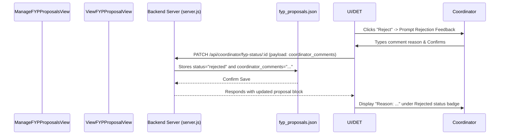

# Architecture & Documentation: Coordinator FYP proposals module

This folder contains the views and component states responsible for managing, reviewing, and tracking **Final Year Project (FYP) proposals** in the coordinator dashboard.

---

## 1. Directory Structure

The module has been refactored into a **Smart-Dumb (Container-Presenter)** architectural pattern to separate stateful/API operations from visual representation:

```
src/views/coordinator/fyp_module/
├── ManageFYPProposalsView.vue   # Smart View Container (Stateful Orchestrator)
├── ViewFYPProposalView.vue      # Proposal Details View (Action Panel)
└── state/                       # Presenter Components (Tab states)
    ├── SubmittedProposalQueue.vue # Queue lists, stats, and filters
    └── FYPProjectRecords.vue      # Assigned project records database & search
```

---

## 2. Architecture & Component Roles

### A. `ManageFYPProposalsView.vue` (The Orchestrator)
- **Role**: Coordinates lifecycle methods, local data states, and fetches all JSON mock data sets.
- **Key Responsibilities**:
  - Communicates with backend endpoints:
    - `GET /api/coordinator/fyp-queue` (proposals list)
    - `GET /api/supervisor-matching/projects` (final record lists)
    - `PATCH /api/coordinator/fyp-status/:id` (approval/rejection updates)
  - Manages tab selection state (`activeTab`).
  - Holds reactive refs (`submittedProposals`, `projectRecords`, `isLoadingQueue`, etc.) and handles API operations.
  - Updates other records synchronously after updating states to keep statistics consistent.

### B. `state/SubmittedProposalQueue.vue` (The Presenter)
- **Role**: Visual layout for checking submitted student proposals.
- **Key Responsibilities**:
  - Receives proposals data as reactive arrays through props.
  - Calculates local computed states (`submittedCount` and `pendingReviewCount` on the list).
  - Handles client-side filtration logic for **Project Type** and **Approval Status**.
  - Emits `@refresh` events to prompt reloading of proposals.
  - Emits `@update-status` events containing `{ projectId, status }` back to the Orchestrator on action triggers.

### C. `state/FYPProjectRecords.vue` (The Presenter)
- **Role**: Searchable registry representing confirmed assignments.
- **Key Responsibilities**:
  - Renders the final projects catalog.
  - Implements local client-side searching utilizing a computed filtering function (`filteredRecords`) matching query strings against Student Name, Matric No, Project Title, Project Type, and Supervisor Name.

### D. `ViewFYPProposalView.vue` (The Action Page)
- **Role**: Detail inspector page (`/manage-fyp/:id`) displaying comprehensive proposal criteria (e.g. abstract, NABC framework, requirements, diagrams).
- **Key Responsibilities**:
  - Executes proposal queries based on route parameters.
  - Displays coordinator approval/rejection operations.
  - Generates custom formatted jsPDF downloads of the proposal document.

---

## 3. Rejection Feedback Workflow

A clean feedback loop ensures students receive actionable rejection guidance while storing histories accurately:



---

## 4. UI / UX Highlights

- **Vibrant Alert Banners**: When a proposal is rejected, a red callout block (`bg-red-50`) displays the rejection comments clearly in [ViewFYPProposalView.vue](file:///d:/Github/application-development-project/src/views/coordinator/fyp_module/ViewFYPProposalView.vue) to alert the viewer.
- **Smart Filtering & Searching**: Seamless client-side filters for queue statuses and regex-less search queries on tables.
- **Micro-Animations**: Uses Vue transition styles and Tailwind-powered active classes for responsive tab switching.
