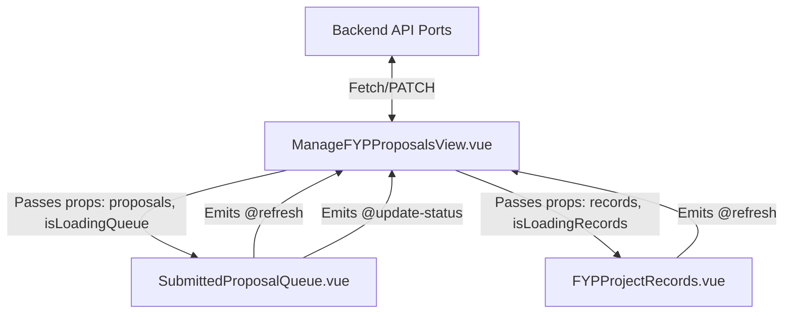

# Proposal: Refactoring ManageFYPProposalsView.vue into Modular Sub-components

Currently, [ManageFYPProposalsView.vue](file:///d:/Github/application-development-project/src/views/coordinator/fyp_module/ManageFYPProposalsView.vue) is a large monolithic component (over 600 lines) that handles page layout, layout styling, state management, API requests, filtration logic, tabular displays, and interaction prompts for two very distinct tabs: the **Submitted Proposal Queue** and the **FYP Project Records**.

Splitting this file into modular sub-components will improve readability, simplify testing, and follow Vue clean-architecture best practices.

---

## 1. Planned Directory Structure

We will place tab-specific sub-components inside a dedicated `components` subdirectory within the `fyp_module` folder to keep the module self-contained:

```
src/views/coordinator/fyp_module/
├── ManageFYPProposalsView.vue (Main Coordinator View & State Controller)
├── ViewFYPProposalView.vue (Proposal Details View)
└── components/
    ├── SubmittedProposalQueue.vue (Submitted Proposal Queue Tab)
    └── FYPProjectRecords.vue (Project Records Database Tab)
```

---

## 2. Component Design & Interfaces

We will use a **Smart-Dumb (Container-Presenter)** component design. The main view container will fetch data and manage endpoints, passing states down to child presenter components as reactive props and listening to custom events.

### Component 1: `SubmittedProposalQueue.vue` (Presenter)
Responsible for rendering the proposal queue, including stats cards, type/status filter dropdowns, and the proposal table.

- **Props:**
  - `proposals` (Array): Mapped list of submitted proposals.
  - `isLoading` (Boolean): Controls spinner display.
  - `error` (String): Errors to render if data retrieval fails.
- **Events:**
  - `@refresh`: Triggered when the "Refresh Queue" button is clicked.
  - `@update-status`: Triggered when the coordinator approves or rejects a proposal. Emits an object: `{ projectId, status }`.

### Component 2: `FYPProjectRecords.vue` (Presenter)
Responsible for rendering the project records database table, including the search input field.

- **Props:**
  - `records` (Array): Complete list of approved/assigned project records.
  - `isLoading` (Boolean): Controls loading spinner display.
  - `error` (String): Errors to render if database retrieval fails.
- **Events:**
  - `@refresh`: Triggered when the refresh button is clicked.

### Component 3: `ManageFYPProposalsView.vue` (Container / Coordinator)
Responsible for rendering headers, layouts, sidebars, the workflow banner, and tabs. It manages all API queries (`/api/coordinator/fyp-queue`, `/api/supervisor-matching/projects`, etc.) and passes state down.

---

## 3. Data and Event Flow



---

## 4. Key Benefits of this Refactoring

1. **Isolation of Concerns**: Filtering, search input state, and UI visual structures are isolated inside child components, keeping the parent controller small and highly readable (~150-200 lines).
2. **Reusability**: Tab components can be reused elsewhere or replaced easily without rewriting layout structures.
3. **Easier Debugging**: Issues relating to filters or visual table styles can be found directly within their specific files rather than parsing a large single document.
